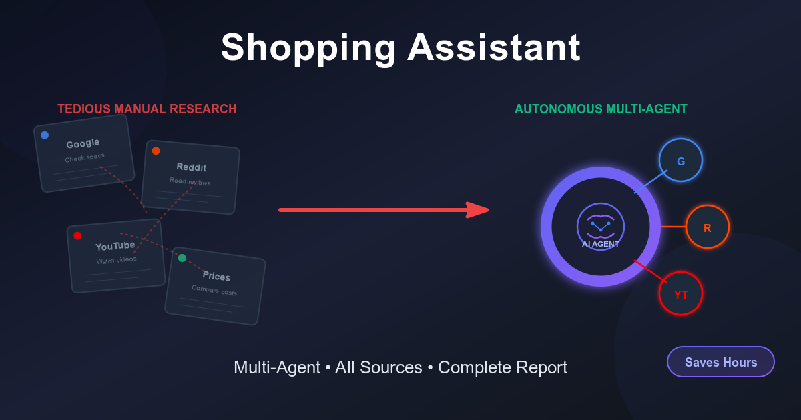
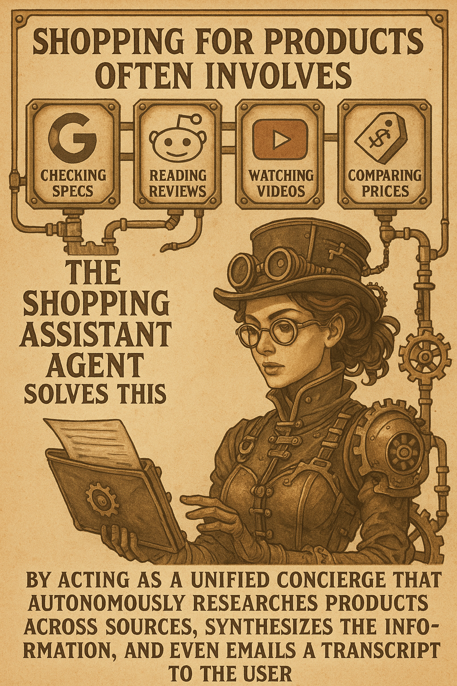

# Shopping Assistant Agent (Google-Kaggle Capstone)

**Track:** Concierge Agents





## Problem Statement
Shopping for products often involves tedious research across multiple platforms: checking specs on Google, reading user reviews on Reddit, watching video reviews on YouTube, and comparing prices. This process is time-consuming and disjointed. The **Shopping Assistant Agent** solves this by acting as a unified concierge that autonomously researches products across these sources, synthesizes the information, and even emails a transcript to the user, saving hours of manual work.

## System Design & Architecture
The system follows a **Hub-and-Spoke Orchestrator Pattern**:
- **Chat Agent (Orchestrator):** The central brain that analyzes user requests, plans tasks, and delegates to specialized sub-agents.
- **Specialized Agents/Tools:**
    - **Search Agent:** Uses Google Search for real-time product specs and pricing.
    - **Reddit Agent:** Scrapes Reddit for authentic user discussions and sentiment.
    - **YouTube Agent:** Finds video reviews for visual confirmation.
    - **Memory Agent:** Persists user preferences (budget, favorite brands) across sessions.
    - **Session Manager:** Handles batched initialization and location caching for efficiency.
    - **Email Tool:** Delivers research summaries to the user.

**Key Concepts Applied:**
1.  **Multi-Agent System:** Orchestrator delegating to domain-specific agents.
2.  **Agent Memory:** Long-term persistence of user preferences.
3.  **Task Decomposition:** Breaking down "find me a laptop" into search, review checking, and synthesis.
4.  **Tool Use:** Integration with external APIs (Google, Reddit, YouTube, SMTP).

## Tools Used
- **Google ADK (Agent Development Kit):** Framework for agent creation.
- **Gemini 2.5 Flash:** Core LLM for reasoning and generation.
- **Google Search:** For real-time web data.
- **Reddit API (PRAW):** For community discussions.
- **YouTube Data API:** For video content.
- **SMTP:** For email delivery.
- **IP-API:** For location detection.

## Code Outline
- `start_agents.py`: Entry point. Launches the ADK server and initializes agents.
- `agents/chat/agent.py`: The main Orchestrator agent logic.
- `tools/session_manager.py`: Handles batching optimizations (Memory + Location).
- `tools/memory_tool.py`: Manages JSON-based long-term memory.
- `tools/delegation_tool.py`: Helper for agent-to-agent communication.
- `docs/batching_options.md`: Documentation of optimization strategies.

## Demo Flow
1.  **Initialization:** Agent greets user, detects location (cached), and retrieves past preferences.
2.  **Request:** User asks "Recommend a gaming laptop under $1500".
3.  **Research:** Agent searches Google for options, then (optionally) checks Reddit/YouTube for the top pick.
4.  **Synthesis:** Agent presents a consolidated recommendation with pros/cons and sources.
5.  **Action:** Agent offers to email the research.
6.  **Completion:** Transcript sent to user's email.


## Evaluation Notes
- **Optimization:** Implemented batching to reduce API calls by ~50% (see `walkthrough.md`).
- **Privacy:** Location data is cached in-memory only and not persisted to disk.
- **Scalability:** The orchestrator pattern allows adding new specialized agents (e.g., Amazon price checker) without rewriting the core logic.


## Setup & Installation

1.  **Install Dependencies**:
    > [!IMPORTANT]
    > Please ensure your environment is properly set up (e.g., using a virtual environment) before running the installation command. The dependencies may not install correctly otherwise.

    ```bash
    pip install -r requirements.txt
    ```

2.  **Environment Variables**:
    Copy `.env.example` to `.env` and fill in your keys:
    ```ini
    GOOGLE_API_KEY=... (Required for Gemini)
    YOUTUBE_API_KEY=... (Optional)
    SMTP_USERNAME=... (Optional for email){Use email id to send the transcript}
    SMTP_PASSWORD=... (Optional for email){Use app password}
    ```

3.  **Run the Agent**:
    ```bash
    python start_agents.py
    ```
    Open the ADK Web Interface at the URL shown in the console (usually `http://localhost:8000`).
